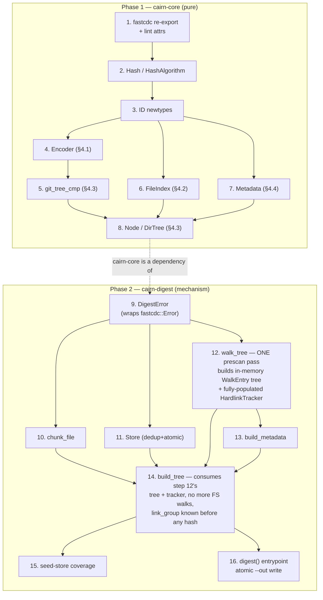

# Implementation plan: cairn-core + cairn-digest

## Context

`cairn-digest.md` is the normative spec for the first real mechanism in this
workspace: walk a directory, chunk its files (FastCDC), and produce a
content-addressed **chunk store** + **dirtree** that can reconstruct the
directory byte-for-byte. All four crates are empty scaffolding today
(`src/lib.rs` is 0 bytes in every crate, verified) — clean start, nothing to
preserve.

This plan refines an existing 16-step draft. I verified the draft's factual
claims directly against the vendored source and they hold:

- `cairn-core/Cargo.toml` already declares `fastcdc = "4.0.1"` (uncommitted,
  confirmed via `git status`/`git diff`). Default features are `[]` — no
  extra deps pulled in (confirmed in the crate's own `Cargo.toml`).
- `fastcdc-4.0.1/src/v2020/mod.rs`: `StreamCDC<R: Read>` is
  `Iterator<Item = Result<ChunkData, Error>>`, `ChunkData { hash: u64,
  offset: u64, length: usize, data: Vec<u8> }`, and `Error` already impls
  `std::error::Error + Display + From<std::io::Error>`. Confirmed by reading
  the source directly (`cargo build -p cairn-core` also succeeds, pulling
  the crate through the proxy).
- `STYLEGUIDE.md` mandates `thiserror`/`anyhow`; the plan's decision to
  hand-write error enums instead (no new deps unless doing something a
  human shouldn't hand-roll, e.g. crypto hashing) is accepted as a locked-in,
  documented deviation, per the user's prior instruction — not re-litigated
  here.

The draft's phase/step breakdown, crate split (cairn-core = pure §3/§4 object
model, cairn-digest = §5/§6/§8 mechanism), unified `Store`, and locked-in
scope decisions (xattrs stubbed empty, no CLI, no threads/BLAKE3 yet) are all
sound and kept as-is. Two things needed fixing before implementation starts:

### Fix 1 (correctness): hardlink `LinkGroupID` assignment must precede tree hashing

The draft's Step 12/14 interleave *walking* and *bottom-up building* in a
single recursive pass, with `HardlinkTracker` populated lazily — "first time
an inode is seen nothing happens; second time, assign `LinkGroupID`." That
breaks §4.3's encoding for the **first-seen** path whenever its containing
directory (or any ancestor) gets fully built and hashed into the store
*before* the second occurrence is discovered elsewhere in the tree (e.g. two
hardlinked files in different subdirectories, or even just later in the same
directory's post-order build if a subdirectory closes out before a sibling
file is visited). Once a `DirTree` is hashed and dedup-written, the `Node`
inside it encoding `has_link_group = 0` is permanently wrong per spec — both
paths in a link group must carry the same `link_group` (§3).

This is exactly why `cairn-digest.md` §5 lists "1. Walk" and "2. Identify
hardlinks" as steps *before* "3. Chunk" / "6. Build DirTree bottom-up": the
hardlink identification is meant to be a complete pass over the whole source
tree, finished before any object is hashed.

**Fix**: split into two passes over the directory, not one:

1. A pure metadata walk (`walk::walk_tree`) recurses the *entire* source
   tree up front, collecting an in-memory tree of `WalkEntry` (this also
   naturally satisfies "no repeated `readdir`/`lstat` calls during the build
   pass" as a side benefit). While walking, it feeds every regular file's
   `(device, inode)` into `HardlinkTracker::observe`, so by the time the walk
   returns, the tracker's `HashMap<Inode, LinkGroupID>` is **complete** — every
   inode that will ever repeat is already known, regardless of visit order.
2. `build::build_tree` then recurses over that already-collected in-memory
   tree (no more filesystem metadata calls except opening regular files to
   chunk them), consulting the now-fully-populated tracker for `link_group`
   on every node it constructs. Order no longer matters — correctness no
   longer depends on discovery order within the walk.

The `FileIndexID` reuse-on-repeat optimization (skip re-chunking a
hardlinked file's second path) is unaffected by this fix and can stay lazy —
it's populated during the build pass, not during the prescan. Reusing vs.
re-chunking is a performance choice only: `chunk_file` is deterministic, so
even without the cache, two hardlinked paths chunk to byte-identical output
and dedup at the `Store` layer by ID anyway (Step 11). Only `LinkGroupID`
correctness required the reordering.

### Fix 2 (test coverage gap): `Device`/`Fifo`/`Socket` node detection is unexercised

The draft's Step 12 walk test covers file/dir/symlink/hardlink but not the
three remaining `NodeKind` variants. `Device` node creation needs root and
isn't practical to test here; `Fifo` needs `mkfifo(2)`, which isn't in `std`
and would require a new dependency (or raw FFI) to test — not worth adding
for this. But `Socket` *is* testable with zero new dependencies:
`std::os::unix::net::UnixListener::bind(path)` creates a real
`AF_UNIX` socket file on disk. Add that to Step 12's walk test to get at
least one of the three "exotic" kinds under real test coverage; explicitly
accept (don't silently drop) that `Device`/`Fifo` walk-detection stays
verified only by code review, consistent with §6.3's own framing that these
aren't expected to be exercised in the primary use case.

Relatedly, the draft never says how `major`/`minor` get extracted from
`MetadataExt::rdev()` for `Device` nodes — Rust `std` has no `major()`/
`minor()` helpers. Step 12 must hand-roll the standard Linux/glibc encoding
(`major = (rdev >> 8) & 0xfff | (rdev >> 32) & !0xfff`, `minor = rdev & 0xff
| (rdev >> 12) & !0xff`) with a comment citing the encoding, since this repo
targets Linux only (per `CLAUDE.md`).

### Fix 3 (mechanical enforcement of STYLEGUIDE): lint attributes

STYLEGUIDE mandates doc comments on every public item and forbids
`.unwrap()`/`.expect()` in library code, but the draft's plain `cargo clippy
-- -D warnings` verification step won't actually catch either violation —
`missing_docs` and `clippy::unwrap_used`/`expect_used` are allow-by-default
lints, not part of clippy's warn-by-default set. Add to both crates' `lib.rs`
(Step 1 for cairn-core, Step 9 for cairn-digest), alongside the existing
crate-level `//!` doc comment:

```rust
#![warn(missing_docs)]
#![warn(clippy::unwrap_used, clippy::expect_used)]
```

This turns two STYLEGUIDE rules that would otherwise rely on memory across
16 steps into something `cargo clippy -- -D warnings` actually enforces from
Step 1 onward.

### Fix 4 (minor): preserve the fastcdc error chain in `DigestError`

Draft Step 9 sketches `DigestError::Chunking(String)` with a comment "Display
of fastcdc::v2020::Error". Since `cairn_core::fastcdc::v2020::Error` already
implements `std::error::Error`, store it directly instead of flattening to a
`String`:

```rust
pub enum DigestError {
    Io(std::io::Error),
    Chunking(cairn_core::fastcdc::v2020::Error),
    StoreCorrupt { expected: Hash, actual: Hash },
    // grow as later steps need more variants
}

impl std::error::Error for DigestError {
    fn source(&self) -> Option<&(dyn std::error::Error + 'static)> {
        match self {
            DigestError::Io(e) => Some(e),
            DigestError::Chunking(e) => Some(e),
            DigestError::StoreCorrupt { .. } => None,
        }
    }
}
```

This costs nothing (no new dependency — the type is already reachable via
the Step 1 re-export) and keeps `.source()` walkable for anyone debugging a
chunking failure, which a flattened `String` would have thrown away.

---

## Plan (16 steps, as drafted except where noted)

Steps below are unchanged from the draft unless marked **[UPDATED]**. Each
step is independently committable; an agent picking up mid-plan reads prior
steps' deliverables in the tree.

### Phase 1 — cairn-core (pure, no workspace deps)

1. **Re-export fastcdc from cairn-core** `cairn-core/src/lib.rs` — **[UPDATED]**
   add the `#![warn(missing_docs)]` / `#![warn(clippy::unwrap_used,
   clippy::expect_used)]` attributes alongside the `//!` crate doc and
   `pub use fastcdc;`. Verify: `cargo build -p cairn-core`; a compile-check
   test naming `cairn_core::fastcdc::v2020::StreamCDC` by path.
   Commit: `cairn-core: add crate doc comment, re-export fastcdc`

2. **Hash & HashAlgorithm** `cairn-core/src/hash.rs` — as drafted:
   `Hash([u8; 32])` with hand-written lowercase-hex `Display` (a 32-byte hex
   loop is trivial and not worth a dependency; only actual cryptographic
   hashing gets an external crate, per the plan's "no new deps unless a
   human shouldn't hand-roll it" rule — hex encoding doesn't meet that bar),
   `HashAlgorithm::Sha256` (default), `hash_bytes(algo, data) -> Hash` via
   `sha2` (the one new dep this step needs — crypto hashing is exactly the
   "human shouldn't hand-roll" exception). Test against the standard empty-
   string and `"abc"` SHA-256 vectors.
   Commit: `cairn-core: add Hash type and SHA-256 hashing (§7)`

3. **ID newtypes** `cairn-core/src/id.rs` — `macro_rules! define_id!`
   generating `ChunkID`/`FileIndexID`/`MetadataID`/`DirTreeID`/`LinkGroupID`,
   each `pub struct XID(pub Hash)` with `Debug, Clone, Copy, PartialEq, Eq,
   Hash, Display` (delegating to `Hash`'s hex).
   Commit: `cairn-core: add content-addressed ID newtypes`

4. **Canonical encoding primitives** `cairn-core/src/encode.rs` — `Encoder`
   wrapping `Vec<u8>`: `write_u32` (LE), `write_str` (u32 len + UTF-8, no
   terminator), `write_bytes` (u32 len + raw), `write_hash` (raw 32B, no
   prefix), `into_bytes`. Byte-exact unit tests per §4.1.
   Commit: `cairn-core: add canonical encoding primitives (§4.1)`

5. **Git tree-sort comparator** `cairn-core/src/sort.rs` —
   `git_tree_cmp(a_name, a_is_dir, b_name, b_is_dir) -> Ordering` per §4.3
   (implicit trailing `/` on dir names for comparison only). Tests: `"a"`
   (dir) sorts before `"aa"` (file); `"foo"` (file) vs `"foo"` (dir) vs
   `"foo.bar"` ordering matches git's actual tree order.
   Commit: `cairn-core: implement git tree-sort comparator (§4.3)`

6. **Object model: Chunk identity + FileIndex** `cairn-core/src/model/`
   — no `Chunk` struct (its "encoding" is its own raw bytes per §3;
   document this in a module comment). `FileIndex { chunks: Vec<ChunkID> }`,
   `encode_canonical()` (u32 count + N×32B), `id(algo) -> FileIndexID`.
   Commit: `cairn-core: add FileIndex object model (§3, §4.2)`

7. **Object model: Metadata** `cairn-core/src/model/metadata.rs` —
   `Metadata { mode: u32, uid: u32, gid: u32, xattrs: Vec<(String, Vec<u8>)> }`,
   constructor sorts+dedups xattrs by name bytes (§4.4). Tests: empty xattrs
   encodes with `xattr_count = 0`; two constructions with xattrs supplied in
   different order hash identically.
   Commit: `cairn-core: add Metadata object model (§4.4)`

8. **Object model: Node, NodeKind, DirTree** `cairn-core/src/model/{node,dirtree}.rs`
   — `NodeKind` (`File{file_index_id}`, `Dir{children_id}`,
   `Symlink{target}`, `Device{major,minor}`, `Fifo`, `Socket`), `Node { name,
   metadata_id, link_group: Option<LinkGroupID>, kind }`, `DirTree { nodes:
   Vec<Node> }` — `encode_canonical()` sorts via Step 5's comparator *before*
   encoding, so callers can hand nodes in any order. Test: scrambled input
   (`"foo"` file / `"foo.bar"` file / `"foo"` dir — the classic trailing-`/`
   ambiguity case) encodes in correct sorted order regardless of input
   order; two constructions from the same nodes in different order hash
   identically.
   Commit: `cairn-core: add Node/DirTree object model (§3, §4.3)`

**Checkpoint**: cairn-core is a complete, dependency-light (`fastcdc`
re-export + `sha2`) pure library implementing §3/§4.

### Phase 2 — cairn-digest (mechanism, depends on cairn-core)

9. **Wire up cairn-core dependency + error type** `cairn-digest/src/error.rs`,
   `lib.rs` — **[UPDATED]** `DigestError` per Fix 4 above (`Chunking` variant
   holds `cairn_core::fastcdc::v2020::Error` directly, manual `source()`).
   Add the same `#![warn(missing_docs)]` / unwrap-lint attributes as Step 1.
   Commit: `cairn-digest: wire up cairn-core dependency and error type`

10. **FastCDC chunking of a single file** `cairn-digest/src/chunk.rs` —
    `ChunkConfig { min_size, avg_size, max_size }` (default 16KiB/64KiB/256KiB
    per §2), `chunk_file(path, config, algo) -> Result<Vec<(ChunkID, Vec<u8>)>,
    DigestError>` via `cairn_core::fastcdc::v2020::StreamCDC` +
    `cairn_core::hash::hash_bytes`. Integration test: chunk a deterministically
    generated multi-hundred-KB file twice, assert identical `ChunkID`
    sequence (determinism); lengths sum to file size; all but the last chunk
    within `[min_size, max_size]` (confirmed against `read_chunk` — final
    chunk is just whatever remains at EOF).
    Commit: `cairn-digest: implement FastCDC file chunking (§5.3)`

11. **Chunk store (dedup, atomic write)** `cairn-digest/src/store.rs` —
    `Store { primary: PathBuf, seeds: Vec<PathBuf> }`, `object_path(dir, id)`
    (flat hex filename — the one function to change for future sharding),
    `contains(id)` (checks primary then seeds in order), `write(id, bytes)`
    — recompute hash, reject on mismatch, skip if already present, else
    write-temp → rename (§8). Tests: idempotent write; `contains()` true for
    seed-only object; `write()` rejects hash/bytes mismatch without writing;
    no `.tmp` left behind after success.
    Commit: `cairn-digest: implement content-addressed store with atomic dedup writes (§6.1, §8)`

12. **Directory walk + hardlink prescan** `cairn-digest/src/walk.rs`,
    `hardlink.rs` — **[UPDATED, see Fix 1]**. `RawKind` enum (`File, Dir,
    Symlink{target}, Device{major,minor}, Fifo, Socket`) via
    `std::fs::symlink_metadata` (never `metadata()` — must not follow
    symlinks) + `FileTypeExt`/`MetadataExt`; hand-rolled major/minor
    extraction from `rdev()` per the Linux encoding (see Fix 2). `WalkEntry
    { name, path, kind, metadata, children: Vec<WalkEntry> }` (recursive —
    `Dir` entries carry their fully-walked children). `walk_tree(root) ->
    Result<(WalkEntry, HardlinkTracker), DigestError>` performs one full
    recursive pass, feeding every regular file's `Inode{device, inode}` into
    the tracker as it goes. `HardlinkTracker` — after `walk_tree` returns,
    exposes `link_group(inode: Inode) -> Option<LinkGroupID>`, fully
    populated (any inode observed ≥2 times has a `LinkGroupID` derived via
    `H("linkgroup" || device.to_le_bytes() || inode.to_le_bytes())`, Step 4's
    `Encoder` + Step 2's `hash_bytes`); lookups afterward don't mutate it.
    Tests (`cairn-digest/tests/walk.rs`) on a temp dir with: 1 plain file, 1
    subdirectory, 1 dangling symlink (recorded, not followed/errored), 2
    hardlinked files **in different subdirectories** (the case Fix 1 exists
    for — assert both get the same `LinkGroupID` after the full walk
    regardless of traversal order), and 1 `UnixListener`-bound socket file
    (Fix 2 — `Socket` kind detected correctly). A standalone file's inode
    never gets a `LinkGroupID`.
    Commit: `cairn-digest: implement directory walk and hardlink prescan (§5.1, §5.2, §6.2)`

13. **Metadata construction from filesystem metadata** `cairn-digest/src/metadata.rs`
    — `build_metadata(meta: &std::fs::Metadata) -> cairn_core::model::Metadata`
    via `MetadataExt` (`mode`/`uid`/`gid`), `xattrs: vec![]` (locked-in
    deferral, one-line comment, not a TODO essay). Tests: built `Metadata`'s
    mode matches a known `set_permissions` value; two fresh files with
    identical permissions hash identically.
    Commit: `cairn-digest: build Metadata from filesystem metadata (§3, §4.4)`

14. **Bottom-up tree assembly** `cairn-digest/src/build.rs` —
    **[UPDATED, see Fix 1]**. `DigestOptions { chunk_config, algo }`.
    `build_tree(walked: &WalkEntry, tracker: &HardlinkTracker, store: &Store,
    options: &DigestOptions) -> Result<DirTreeID, DigestError>` — recurses
    over the **already-walked** in-memory tree from Step 12 (no further
    `readdir`/`lstat` calls), post-order: `Dir` recurses into `children`
    first; `File` — if this inode's `FileIndexID` is already cached (a
    `HashMap<Inode, FileIndexID>` threaded through the recursion,
    opportunistically populated, purely a re-chunk-avoidance optimization —
    see Fix 1's note that correctness doesn't depend on this cache), reuse
    it, else `chunk_file` + dedup-write a fresh `FileIndex`; every node
    consults `tracker.link_group(inode)` (already fully known from the
    Step 12 prescan) to set `Node.link_group`. Build+dedup-write `Metadata`
    for every node. Assemble sorted `Node`s into a `DirTree`, dedup-write,
    return the root `DirTreeID`.
    Integration test (`tests/end_to_end.rs`): nested tree with two files with
    *identical content* in different subdirectories (cross-file dedup), one
    cross-directory hardlink pair, one symlink, one nested subdirectory.
    Assert: (a) two separate `build_tree` runs into two empty stores produce
    the same `DirTreeID` (determinism); (b) store file count is
    hand-computable and lower than one-chunk-per-file would suggest
    (cross-file dedup fired); (c) re-running against the same store writes
    zero new files; (d) — new, exercising Fix 1 — the hardlinked pair's two
    `Node`s (fetched by walking the resulting `DirTree`s back out of the
    store) carry the same non-`None` `link_group`.
    Commit: `cairn-digest: implement bottom-up tree assembly (§5 full algorithm)`

15. **`--seed-store` integration coverage** `cairn-digest/tests/seed_store.rs`
    — as drafted: build store A with chunk C; build a second source sharing
    content C into a fresh empty store B with `seeds: vec![A]`; assert C's
    file exists only in A, not B.
    Commit: `cairn-digest: add integration coverage for --seed-store dedup (§6.1)`

16. **Top-level `digest()` entrypoint** `cairn-digest/src/lib.rs` (or
    `src/digest.rs` re-exported) — as drafted: `digest(src_dir, store,
    out_path, options) -> Result<DirTreeID, DigestError>` calls `walk_tree`
    then `build_tree`, then writes the root `DirTreeID`'s 32 bytes to
    `out_path` via write-temp-rename (§8), only after `build_tree` has
    synchronously dedup-written every reachable object. Tests: success case
    (`out_path` is exactly the 32 raw ID bytes); failure case (nonexistent
    `src_dir` → `Err` and `out_path` never created).
    Commit: `cairn-digest: add digest() entrypoint with atomic --out write (§8)`

**Checkpoint**: cairn-digest fully implements the spec (minus xattrs,
threading, BLAKE3, CLI — all explicitly deferred, see draft's "Explicitly
out of scope" section, unchanged). `cargo test --workspace` green.

---

## Dependency / data-flow shape



The key shape change from the draft: **12 finishes entirely (including
`HardlinkTracker`) before 14 starts**, rather than the two being interleaved
in one recursive pass. Everything else in the draft's dependency graph is
unchanged.

## Verification of the whole plan

After all 16 steps: `cargo build --workspace`, `cargo test --workspace`,
`cargo clippy --workspace -- -D warnings` all pass with zero
errors/warnings (now actually catching missing docs / stray unwraps thanks
to Fix 3's lint attributes), and `cairn-digest/tests/end_to_end.rs`
demonstrates the full spec loop (walk → chunk → dedup → hash → atomic
write) — including the cross-directory hardlink case that Fix 1 exists to
get right — against a real temp directory on disk.
